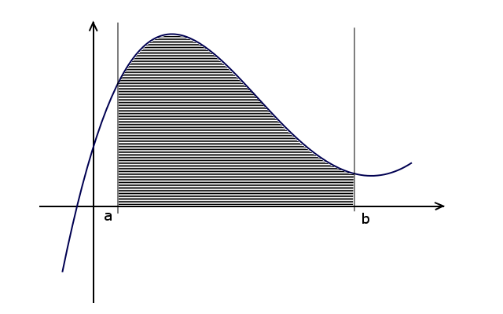

@mainpage Strona główna

To jest strona glówna dokumentacji.

@section Metoda_Prostokatow

Jak to wyglada na wykresie:

Obliczanie całki funkcji f(x) w przedziale [a,b] przy użyciu metody prostokątów.
Wzór użyty do obliczania całki wygląda następująco:
\f[
\int_{a}^{b}f(x),dx \approx h \cdot \left(\frac{f(a) + f(a + h) + f(a + 2h) + ... + f(b - h) + f(b)}{2}\right)
\f]
gdzie h = \f$\frac{b-a}{n}\f$.
